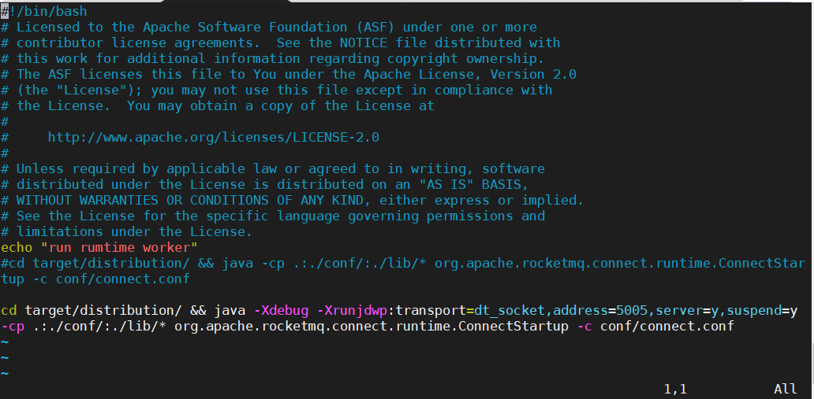

# 远程调试向导

代码打成Jar之后，要如何进行Debug呢？
下面以IDEA基于单机环境进行说明：

**修改run_worker.sh**

`cd target/distribution/ && java -Xdebug -Xrunjdwp:transport=dt_socket,address=5005,server=y,suspend=y -cp .:./conf/:./lib/* org.apache.rocketmq.connect.runtime.ConnectStartup -c conf/connect.conf`

启动`run_worker.sh`之后，你会发现，有如下提示：
`Listening for transport dt_socket at address: 5005`

这个时候，就卡在这不动了，然后我们进行下面这步：

**配置IDEA**

IDEA->Run->Edit Configurations-> `+`-> remote



**特别提醒**
IDEA remote debug 里的`host`是`rocketmq-connect-runtime`所在的主机IP (如果是从外网连入，则是公网IP)， `port` 要和`run_worker.sh`里所填的`address`一致
案例里是调试选择runtime作为例子，如果是调试某一个`connector`以`rocketmq-connect-jdbc`为例，则在打开它的源码基础上`Use module classpath`要选择为对应的包`rocketmq-connect-jdbc`


**启动Debug**

这个时候，只要你打了断点了，应该会发现IDEA的debug窗口显示调试信息且可以进行正常 debug 了。